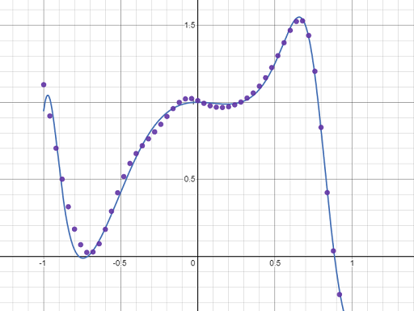

# Maxml

Machine learning library written in pure C++.

# About

I decided to write this library as a way to explore machine learning and improve my C++ knowledge + skills.
I am particularly interested in image processing with convolutional neural networks (CNNs).

# MNIST Example

Say we want a model which classifies the value of hand written digits


First we create the description of our convolutional neural network and use it to create a sequential model

```C++
maxml::SequentialDesc seqDesc;
seqDesc.ObjectiveFunc = maxml::LossFunc::CrossEntropy;
seqDesc.LearningRate = 0.0005f;
seqDesc.LayerDescs = {
	maxml::makeInput(1, 28, 28),
	maxml::makeConv(32, 5, 5, maxml::ActivationFunc::ReLU),
	maxml::makePool(2, 2, maxml::PoolingFunc::Max),
	maxml::makeConv(32, 3, 3, maxml::ActivationFunc::ReLU),
	maxml::makePool(2, 2, maxml::PoolingFunc::Max),
	maxml::makeFlatten(),
	maxml::makeFullCon(64, maxml::ActivationFunc::ReLU),
	maxml::makeFullCon(64, maxml::ActivationFunc::ReLU),
	maxml::makeFullCon(10, maxml::ActivationFunc::Softmax)
};

maxml::Sequential seq(seqDesc);
```

Next we train the model

```C++
for (int i = 0; i < kNumIterations; i++)
{
  	int choice = rand() % trainData.size();

	const maxml::DTensor &inp = trainData[choice].first;
	const maxml::DTensor &exp = trainData[choice].second;

	const maxml::DTensor &out = seq.feedForward(inp);
	double err = seq.feedBackward(exp);
}
```

After 500,000 iterations we arrive at the following accuracy

```
Training for 500000 iterations...
Iteration (500000), Error = 0.0170740020
Testing...
9819/10000 correct guesses, thats 98.1899976730%
```

# Regression Example

Say we want to fit a sequential neural network model to the following function


First we create the description of our neural network and use it to create a sequential model

```C++
maxml::SequentialDesc seqDesc;
seqDesc.ObjectiveFunc = maxml::LossFunc::MSE;
seqDesc.LearningRate = 0.1f;
seqDesc.LayerDescs = {
	maxml::makeInput(1, 1, 1),
	maxml::makeFullCon(16, maxml::ActivationFunc::Tanh),
	maxml::makeFullCon(8, maxml::ActivationFunc::Tanh),
	maxml::makeFullCon(1, maxml::ActivationFunc::None)
};

maxml::Sequential seq(seqDesc);
```

Next we train the model

```C++
for (int i = 0; i < kNumIterations; i++)
{
  	int choice = rand() % trainData.size();

	const maxml::DTensor &inp = trainData[choice].first;
	const maxml::DTensor &exp = trainData[choice].second;

	const maxml::DTensor &out = seq.feedForward(inp);
	double err = seq.feedBackward(exp);
}
```

After 500,000 iterations we arrive at the following fit


